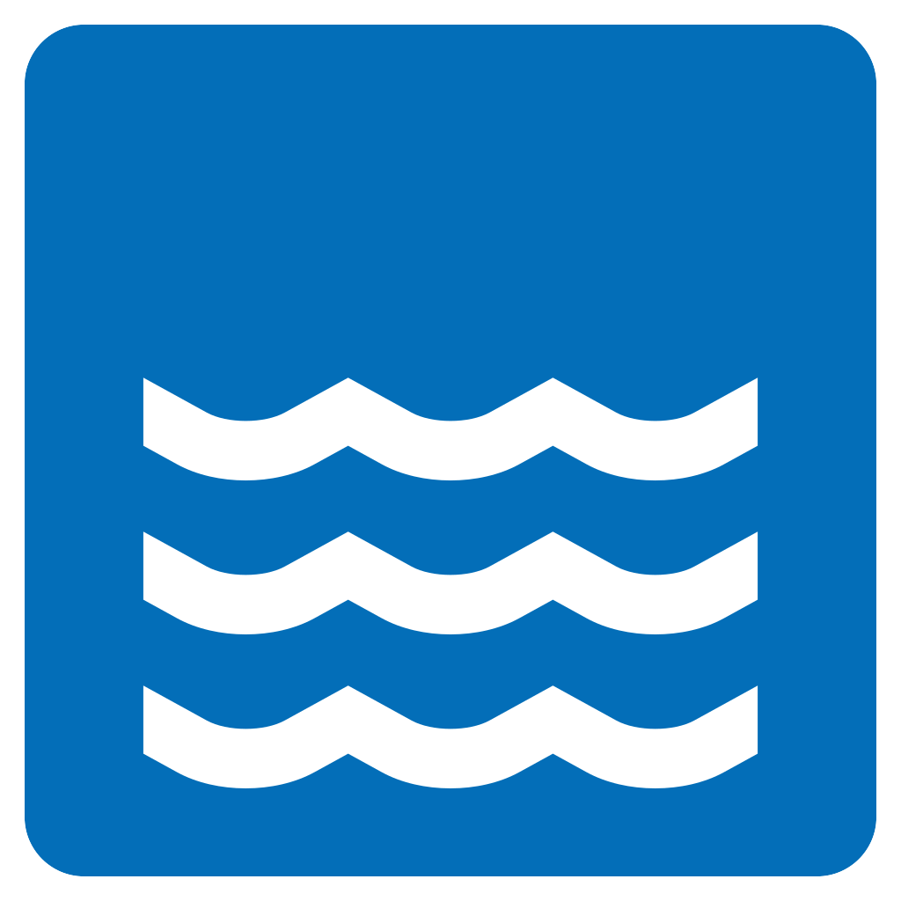

<p align="center">
  <a href="" target="blank"></a>
</p>

[](https://opensource.org/licenses/MIT)

# Description

해당 예제는 DynamoDB에서 사용하는 `transactional log` 기능을 담당하는 DynamoDB Stream를 사용방법과 테스트 방법에 대한 예제를 테스트하기 위함이다.
가장 간단하게 사용할 수 있는 유즈 케이스가 사용자 가입(sign up) 시 후처리에 부분이다.

## Getting Started


### Scaffolding Serverless project

우선 serverless template를 생성한다.

```bash
➜ sls create --template aws-nodejs
```

### Installing plugin

npm으로 nodejs 프로젝트를 초기화 한다.

```
➜ npm init
```

필요한 플러그인을 설치한다. 여기서는 offline 테스트를 위하여 아래 3가지 플러그인을 설치하도록 하겠다.
```
➜ npm install serverless-offline
➜ npm install --save serverless-dynamodb-local
➜ npm install serverless-plugin-offline-dynamodb-stream
```


### Running Local DynamoDB

`serverless-dynamodb-local` 플러그인을 설치했다면 아래 처럼 dynamodb를 설치해서 로컬환경에서 사용할 수 있다.

```bash
➜ sls dynamodb install
```

이제 준비가 되었다면 로컬 다이나모를 실행시켜보자.

```bash
# 아래 명령으로 실행
➜ sls dynamodb start &

# 또는 아래와 같은 명령을 입력
➜ npm run run:local:dynamodb
Dynamodb Local Started, Visit: http://localhost:8000/shell
```

위와 같이 입력하면, `Web Shell` 이 시작된다. 화면에 아래 코드를 입력하면 테이블이 생성된다.

```javascript 
var params = {
    TableName: 'usersTable',
    KeySchema: [
        {
            AttributeName: 'email',
            KeyType: 'HASH'
        }
    ],
    AttributeDefinitions: [
        {
            AttributeName: 'email',
            AttributeType: 'S'
        }
    ],
    ProvisionedThroughput:  {
        ReadCapacityUnits: 1,
        WriteCapacityUnits: 1
    }
};
// console.log("The CreateTable params aren't complete yet. Continue on to the next steps of the tutorial.");
dynamodb.createTable(params, function(err, data) {
    if (err) ppJson(err); // an error occurred
    else ppJson(data); // successful response
    console.log("CreateTable returned")
});
```

### Implementing sign-up


## License
- MIT